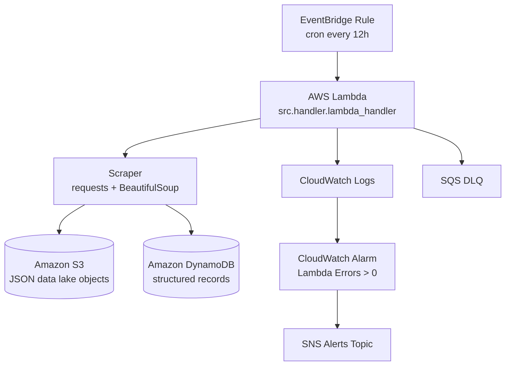

# Serverless Automated Data Extraction Pipeline

A production-minded serverless data extraction pipeline using AWS Lambda, EventBridge, S3, DynamoDB, CloudWatch, SNS, and SQS DLQ.

## Architecture



## Data Flow

1. EventBridge triggers the Lambda every 12 hours.
2. Lambda loads validated environment configuration.
3. Scraper fetches HTML using a retry-enabled HTTP session.
4. Each page is parsed once to extract item fields and the next page URL.
5. Payload is enriched with execution UUID and UTC timestamp.
6. Data is written to S3 as one timestamped JSON object and/or written to DynamoDB.
7. DynamoDB writes use conditional puts for idempotency.
8. CloudWatch Alarm sends notifications to SNS if Lambda errors occur.
9. Failed async invocations can be routed to SQS DLQ.

## Project Structure

- `src/config.py` – environment helpers, URL validation, execution identity
- `src/scraper.py` – HTTP session/retries, fetch, parse, pagination
- `src/storage/s3.py` – S3 key and object write logic
- `src/storage/dynamodb.py` – DynamoDB idempotent writes
- `src/handler.py` – Lambda orchestration and JSON logging
- `tests/test_scraper.py` – parser/unit tests
- `tests/test_handler.py` – moto-backed integration test
- `template.yaml` – SAM infrastructure definition

## Local Development

### 1) Prerequisites

- Python 3.10+
- Docker running and accessible by your user
- AWS SAM CLI installed

### 2) Install dev dependencies

```bash
python -m venv .venv
source .venv/bin/activate
pip install -e .[dev]
```

### 3) Layer dependencies

Deployment dependencies are intentionally separated in:

- `layer/data_extraction_layer/requirements.txt`

These are packaged as a Lambda Layer by SAM during build.

### 4) Build and invoke locally

Use your existing `event.json` and `env.json`:

```bash
sam build --use-container
sam local invoke "DataExtractionFunction" -e event.json -n env.json
```

### 5) Run tests

```bash
pytest
```

### 6) Lint and type check

```bash
ruff check .
mypy src tests
```

## Configuration

Environment variables used by the Lambda:

- `SOURCE_URL` (must be valid `http`/`https` URL)
- `STORAGE_MODE` (`S3`, `DYNAMODB`, `BOTH`)
- `BUCKET_NAME`
- `TABLE_NAME`
- `MAX_PAGES`
- `HTTP_TIMEOUT_SECONDS`
- `S3_PREFIX`
- `LOG_LEVEL`
- `S3_SSE_MODE` (`AES256` or `aws:kms`)
- `S3_KMS_KEY_ID` (optional; used when `S3_SSE_MODE=aws:kms`)

## Idempotency and DynamoDB write strategy

DynamoDB writes use `put_item` with a `ConditionExpression` on the composite key (`item_id`, `extraction_timestamp`) to prevent duplicates on retries. `batch_write_item` cannot enforce per-item conditional expressions, so conditional single writes are retained intentionally.

## Deployment

```bash
sam build --use-container
sam deploy --guided
```

## Monitoring and Alerts

- CloudWatch Alarm: Lambda `Errors > 0` over one evaluation period.
- Alarm action: SNS Topic notification.
- SQS DLQ attached to Lambda for failed asynchronous events.
